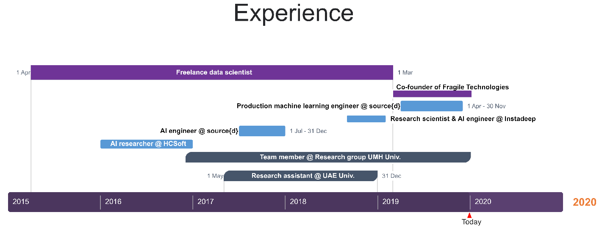
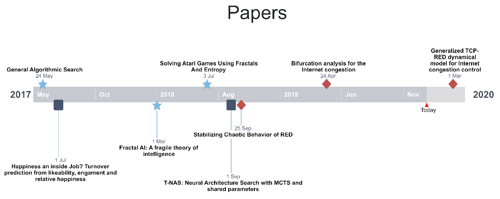

## Guillem Duran Ballester

Welcome to my CV!

<strong>About me</strong>

 
I am a data scientist and a Python developer. I love solving machine learning challenges, teaching, learning and coding.
I am a PyData Mallorca co-organizer because I enjoy contributing to the Open Source community.
 
I've enjoyed Barcelona, Murcia, Madrid, Paris, and London, but I finally settled down in Palma, where I grew up.
 

 

### Work Experience

---

 

<strong>Freelance  data  scientist (Apr 15 - Mar 19)</strong>

I developed a tool to analyze and cluster the developers and repositories of an organization using their git commit history.

 

<strong>Fragile Technologies co-founder (Mar 19 - Present)</strong> 

I developed a tool to analyze and cluster the developers and repositories of an organization using their git commit history.

 

#### Full time jobs in private companies
***

<strong>Production machine learning engineer @ source{d} (Apr 19 - Dec 19)</strong> 

I developed a tool to analyze and cluster the developers and repositories of an organization using their git commit history.

 

<strong>Research scientist & AI engineer @ Instadeep (Sep 18 - Feb 19)</strong> 

I developed a tool to analyze and cluster the developers and repositories of an organization using their git commit history.

 

<strong>AI engineer @ source{d} (Jul 17 - Dec 17)</strong> 

I developed a tool to analyze and cluster the developers and repositories of an organization using their git commit history.

 

<strong>AI researcher @ HCSoft Programación (Jan 16 - Dec 16)</strong> 

I developed a tool to analyze and cluster the developers and repositories of an organization using their git commit history.

 

#### Academic research
***

<strong>Team member @ Research group UMH Univ. (Dec 16 - Present)</strong> 

Aplicaciones de los Sistemas Dinámicos Discretos y Continuos, MTM2016-74921-P  (AEI/FEDER,  UE). UMH Univ., Elche, Spain

 

<strong>Research assistant @ University of the United Arab Emirates (May 17 - Dec 18)</strong> 

Research assistant at University of the United Arab Emirates (Al Ain - Abu Dhabi),UAE. Robots and media lab

 

<strong>Research assistant @ University of the United Arab Emirates (May 17 - Dec 18)</strong> 

Research assistant at University of the United Arab Emirates (Al Ain - Abu Dhabi),UAE. Robots and media lab

 

#### Talks and workshops
***

summary table

<table class="tg">
  <tr>
    <th class="tg-0pky">Name</th>
    <th class="tg-c3ow">Presented at</th>
    <th class="tg-c3ow">Category</th>
    <th class="tg-c3ow">When</th>
    <th class="tg-c3ow">Where</th>
  </tr>
  <tr>
    <td class="tg-0pky">Applied Fractal AI</td>
    <td class="tg-c3ow">Graz Univ.</td>
    <td class="tg-c3ow">Talk</td>
    <td class="tg-c3ow">Dec 2019</td>
    <td class="tg-c3ow">Graz (Austria)</td>
  </tr>
  <tr>
    <td class="tg-0pky">Introducción a data science en Python (V4)</td>
    <td class="tg-c3ow">PyConES</td>
    <td class="tg-c3ow">Workshop</td>
    <td class="tg-c3ow">Oct 2019</td>
    <td class="tg-c3ow">Alicante (Spain)</td>
  </tr>
  <tr>
    <td class="tg-0pky">Aprendiendo como aprenden las máquinas (V2)</td>
    <td class="tg-c3ow">PyConES</td>
    <td class="tg-c3ow">Workshop</td>
    <td class="tg-c3ow">Oct 2019</td>
    <td class="tg-c3ow">Alicante (Spain)</td>
  </tr>
  <tr>
    <td class="tg-0pky">Aprendiendo como aprenden las máquinas (V1)</td>
    <td class="tg-c3ow">PyData Mallorca</td>
    <td class="tg-c3ow">Workshop</td>
    <td class="tg-c3ow">Sep 2019</td>
    <td class="tg-c3ow">Palma (Spain)</td>
  </tr>
  <tr>
    <td class="tg-0pky">Introducción a data science en Python (V3)</td>
    <td class="tg-c3ow">PyData Mallorca</td>
    <td class="tg-c3ow">Workshop</td>
    <td class="tg-c3ow">Jul 2019</td>
    <td class="tg-c3ow">Felanitx (Spain)</td>
  </tr>
  <tr>
    <td class="tg-0pky">Generalized TCP-RED dynamical model for Internet congestion control</td>
    <td class="tg-c3ow">Miguel Hernández Univ.</td>
    <td class="tg-c3ow">Talk</td>
    <td class="tg-c3ow">Feb 2019</td>
    <td class="tg-c3ow">Elche (Spain)</td>
  </tr>
  <tr>
    <td class="tg-0pky">Hacking Reinforcement Learning (20 min version)</td>
    <td class="tg-c3ow">PyConES</td>
    <td class="tg-c3ow">Talk</td>
    <td class="tg-c3ow">Oct 2018</td>
    <td class="tg-c3ow">Málaga (Spain)</td>
  </tr>
  <tr>
    <td class="tg-0pky">Introducción a data science en Python (V2)</td>
    <td class="tg-c3ow">PyConES</td>
    <td class="tg-c3ow">Workshop</td>
    <td class="tg-c3ow">Oct 2018</td>
    <td class="tg-c3ow">Málaga (Spain)</td>
  </tr>
  <tr>
    <td class="tg-0pky">Introducción a data science en Python (V1)</td>
    <td class="tg-c3ow">PyData Mallorca</td>
    <td class="tg-c3ow">Workshop</td>
    <td class="tg-c3ow">Sep 2018</td>
    <td class="tg-c3ow">Palma (Spain)</td>
  </tr>
  <tr>
    <td class="tg-0pky">Hacking Reinforcement Learning</td>
    <td class="tg-c3ow">EuroPython</td>
    <td class="tg-c3ow">Talk</td>
    <td class="tg-c3ow">Jul 2018</td>
    <td class="tg-c3ow">Edinburgh (UK)</td>
  </tr>
  <tr>
    <td class="tg-0pky">Introduction to Fractal AI</td>
    <td class="tg-c3ow">Alicante Univ.</td>
    <td class="tg-c3ow">Talk</td>
    <td class="tg-c3ow">Mar 2018</td>
    <td class="tg-c3ow">Alicante (Spain)</td>
  </tr>
  <tr>
    <td class="tg-0pky">Reinforcement learning for developers</td>
    <td class="tg-c3ow">PiterPy</td>
    <td class="tg-c3ow">Talk</td>
    <td class="tg-c3ow">Nov 2017</td>
    <td class="tg-c3ow">St. Petersburg (Russia)</td>
  </tr>
  <tr>
    <td class="tg-0pky">Inside Airbnb: Visualizing data that includes geographic locations</td>
    <td class="tg-c3ow">EuroPython</td>
    <td class="tg-c3ow">Talk</td>
    <td class="tg-c3ow">Jul 2017</td>
    <td class="tg-c3ow">Rimini (Italy)</td>
  </tr>
  <tr>
    <td class="tg-0pky">Happiness inside a job: a social network analysis (V2)</td>
    <td class="tg-c3ow">Miguel Hernández Univ.</td>
    <td class="tg-c3ow">Talk</td>
    <td class="tg-c3ow">Jul 2017</td>
    <td class="tg-c3ow">Elche (Spain)</td>
  </tr>
  <tr>
    <td class="tg-0pky">Potential applications of Fractal AI to Machine Learning</td>
    <td class="tg-c3ow">source{d}</td>
    <td class="tg-c3ow">Workshop</td>
    <td class="tg-c3ow">Jun 2017</td>
    <td class="tg-c3ow">Madrid (Spain)</td>
  </tr>
  <tr>
    <td class="tg-0pky">Happiness inside a job: a social network analysis (V1)</td>
    <td class="tg-c3ow">PyData Barcelona</td>
    <td class="tg-c3ow">Talk</td>
    <td class="tg-c3ow">May 2017</td>
    <td class="tg-c3ow">Barcelona (Spain)</td>
  </tr>
  <tr>
    <td class="tg-0pky">Introduction to Fractal AI theory for researchers and Phd. students</td>
    <td class="tg-c3ow">Zaragoza Univ.</td>
    <td class="tg-c3ow">Workshop</td>
    <td class="tg-c3ow">Mar 2017</td>
    <td class="tg-c3ow">Zaragoza (Spain)</td>
  </tr>
  <tr>
    <td class="tg-0pky">Introduction to data science</td>
    <td class="tg-c3ow">PyData Mallorca</td>
    <td class="tg-c3ow">Workshop</td>
    <td class="tg-c3ow">Feb 2017</td>
    <td class="tg-c3ow">Palma (Spain)</td>
  </tr>
  <tr>
    <td class="tg-0pky">Per shaolin ad astra</td>
    <td class="tg-c3ow">PyConES</td>
    <td class="tg-c3ow">Talk</td>
    <td class="tg-c3ow">Oct 2016</td>
    <td class="tg-c3ow">Almería (Spain)</td>
  </tr>
  <tr>
    <td class="tg-0pky">Interactive Data Kung Fu with Shaolin</td>
    <td class="tg-c3ow">EuroPython</td>
    <td class="tg-c3ow">Talk</td>
    <td class="tg-c3ow">Jul 2016</td>
    <td class="tg-c3ow">Bilbao (Spain)</td>
  </tr>
</table>

 

### Papers

----

Find me on [Google scholar](https://scholar.google.es/citations?hl=ca&user=xx1L5RYAAAAJ&view_op=list_works&gmla=AJsN-F7et6TNmz2cKVuBQk-tBNnHA2OIj5WmyzAJcUrETa_9tup1w0aLtv0bU-aPFyUiY6GXiv9-oieJ8TwQA5uywUVBiJp4ij7nJcSunnMdQQmsxfmB1Dp4OdyR7OrcsL9nBZWg9hSH22IHShS1gB6V10Vj92SA4iouIUwvzBlKiQOj_Zo04xY).

 

<table class="tg">
  <tr>
    <th class="tg-0lax">Name</th>
    <th class="tg-0lax">Published</th>
    <th class="tg-0lax">Date</th>
  </tr>
  <tr>
    <td class="tg-0lax">Generalized TCP-RED dynamical model for Internet congestion control</td>
    <td class="tg-0lax">Communications in Nonlinear Science and Numerical Simulation 82, 105075</td>
    <td class="tg-0lax">March 2020</td>
  </tr>
  <tr>
    <td class="tg-0lax">Bifurcation analysis for the Internet congestion</td>
    <td class="tg-0lax">IEEE INFOCOM 2019-IEEE Conference on Computer Communications Workshops (INFOCOM WKSHPS)</td>
    <td class="tg-0lax">April 2019</td>
  </tr>
  <tr>
    <td class="tg-0lax">Stabilizing Chaotic Behavior of RED</td>
    <td class="tg-0lax">2018 IEEE 26th International Conference on Network Protocols (ICNP), 241-242</td>
    <td class="tg-0lax">September 2018</td>
  </tr>
  <tr>
    <td class="tg-0lax">T-NAS: Neural Architecture Search with MCTS and shared parameters</td>
    <td class="tg-0lax">Deep learning Indaba conference</td>
    <td class="tg-0lax">September 2018</td>
  </tr>
  <tr>
    <td class="tg-0lax">Solving Atari Games Using Fractals And Entropy</td>
    <td class="tg-0lax">Arxiv</td>
    <td class="tg-0lax">July 2018</td>
  </tr>
  <tr>
    <td class="tg-0lax">Fractal AI: A fragile theory of intelligence</td>
    <td class="tg-0lax">Arxiv</td>
    <td class="tg-0lax">March 2018</td>
  </tr>
  <tr>
    <td class="tg-0lax">Happiness an inside Job? Turnover prediction from likeability, engament and relative happiness</td>
    <td class="tg-0lax">Proceedings of the 2017 IEEE/ACM International Conference on Advances in Social Networks Analysis and Mining 2017</td>
    <td class="tg-0lax">July 2017</td>
  </tr>
  <tr>
    <td class="tg-0lax">General Algorithmic Search</td>
    <td class="tg-0lax">Arxiv</td>
    <td class="tg-0lax">May 2017</td>
  </tr>
</table>