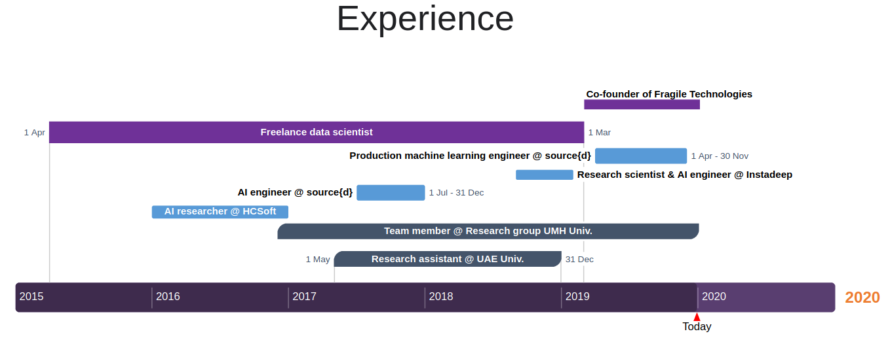

    

    
    

    

    
    

    

    
    

 

# Professional CV

Welcome to my CV! This page is is still under construction

<strong>About me</strong>

 
I am a data scientist and a Python developer. I love solving machine learning challenges, teaching, learning and coding.
I am a PyData Mallorca co-organizer because I enjoy contributing to the Open Source community.
 
I've enjoyed Barcelona, Murcia, Madrid, Paris, and London, but I finally settled down in Palma, where I grew up.
 

 

## Work Experience

---

 

### Self employed
***

<strong>Freelance  data  scientist (Apr 15 - Mar 19)</strong>

I worked as a contractor in different kinds of projects such as:
 

    

        <ul style="list-style-type:disc;">
          <li>Training econometric models to predict antibiotic resistance.</li>
          <li>Predicting prices of real state assets.</li>
          <li>Designing data pipelines for small businesses.</li>
        </ul>  
    

    

        <ul style="list-style-type:disc;">
          <li>Mining criptocurrency data from different sources.</li>
          <li>Using NLP models to predict blockchain ICO success.</li>
          <li>Predicting employees churn rate.</li>
        </ul>  
    

 

<strong>Fragile Technologies co-founder (Mar 19 - Present)</strong> 

I collaborate with my associates to provide the following services:
 
<ul style="list-style-type:disc;">
    <li>Developing custom algorithms to solve NP hard problems</li>
    <li>Advising on data science projects: infrastructure, architecture, product design and deployment</li>
    <li>Developing new Reinforcement Learning algorithms.</li>
</ul>  

 

### Full time jobs in private companies
***

<strong>Production machine learning engineer @ source{d} (Apr 19 - Dec 19)</strong> 

Working remotely as a part of the production machine learning team I have:
 
<ul style="list-style-type:disc;">
    <li>Designed, implemented, and deployed a tool that classified the projects and developers of a Github organization based on their commit history</li>
    <li>Maintained the Machine Learning stack of the company.</li>
    <li>Maintained the Docker containers, and the continuous integration pipeline of the ML projects.</li>
    <li>Optimized the performance of the team's algorithm by deploying them in a pyspark cluster.</li>
    <li>Built interactive dashboards using Apache Superset and different Python visualization libraries.</li>
</ul>  

 

<strong>Research scientist & AI engineer @ Instadeep (Sep 18 - Feb 19)</strong> 

Working at the Paris and London offices I improved my mentoring and research skills.
 
<ul style="list-style-type:disc;">
    <li>I taught and enforced code and documentation quality standards.</li>
    <li>I Supervised and helped Phd. students with their research.</li>
    <li>I designed a novel architecture search and optimization pipeline in Pytorch based on AlphaZero.</li>
    <li>I collaborated in the design of core business algorithms.</li>
    <li>I implemented many different Reinforcement Learning algorithms for both continuous and discrete problems.</li>
</ul>  

 

<strong>AI engineer @ source{d} (Jul 17 - Dec 17)</strong> 

Source{d} sponsored my research on Fractal AI. During my six months contract I:
 
<ul style="list-style-type:disc;">
    <li>Implemented a prototype of a planning algorithm based in our AI theory.</li>
    <li>Built a reinforcement learning library in Keras.</li>
    <li>Combined my planning algorithms with deep learning to improve their scalability.</li>
    <li>Learned best coding and documentation practices.</li>
</ul>  

 

<strong>AI researcher @ HCSoft Programación (Jan 16 - Dec 16)</strong> 

 
At HCSoft I contributed to developing the theoretical foundations of the Fractal AI theory.
 
<ul style="list-style-type:disc;">
    <li>Helped in develop the theoretical foundations of Fractal AI theory.</li>
    <li>Build prototypes to test different research hypothesis.</li>
    <li>Coded visualization and debugging tools for planning and optimization algorithms.</li>
    <li>Designed prototypes for solving different NP hard problems.</li>
</ul>  

 

### Academic research
***

<strong>Team member @ Research group UMH Univ. (Dec 16 - Present)</strong> 

I am a team member of "Aplicaciones de los Sistemas Dinámicos Discretos y Continuos, MTM2016-74921-P  (AEI/FEDER,  UE)" at
 UMH Univ., Elche, Spain. In this team, I work with a team of University professors that specialize in complex systems analysis.
 
<ul style="list-style-type:disc;">
    <li>I propose new research topics that take advantage of an interdisciplinary team.</li>
    <li>I test research hypothesis coding prototypes in Python.</li>
    <li>I code visualizations and figures for the papers we publish.</li>
</ul>  

 

<strong>Research assistant @ University of the United Arab Emirates (May 17 - Dec 18)</strong> 

Research assistant at University of the United Arab Emirates (Al Ain - Abu Dhabi),UAE. Robots and media lab.

 

<strong>Cloud computing DevOps internship @ Polytechnic University of Catalonia  (Jun 14 - Dec 14)</strong> 

I installed, configured and administrated an OpenNebula-based cloud computing.

 

## Talks and workshops
***

summary table (click me)

<table class="tg">
  <tr>
    <th class="tg-0pky">Name</th>
    <th class="tg-c3ow">Presented at</th>
    <th class="tg-c3ow">Category</th>
    <th class="tg-c3ow">When</th>
    <th class="tg-c3ow">Where</th>
  </tr>
  <tr>
    <td class="tg-0pky"><a href="https://docs.google.com/presentation/d/1ZkrfHSchUDXSdSv9eRjk-tUAertezRmeqyb7EtSD64o/edit?usp=sharing">
    Applied Fractal AI</a> </td>
    <td class="tg-c3ow">Graz Univ.</td>
    <td class="tg-c3ow">Talk</td>
    <td class="tg-c3ow">Dec 2019</td>
    <td class="tg-c3ow">Graz (Austria)</td>
  </tr>
  <tr>
    <td class="tg-0pky"><a href="https://github.com/PyDataMallorca/FTW2019_Introduccion_a_data_science_en_Python">
   Introducción a data science en Python (V4) </a> </td>
    <td class="tg-c3ow">PyConES</td>
    <td class="tg-c3ow">Workshop</td>
    <td class="tg-c3ow">Oct 2019</td>
    <td class="tg-c3ow">Alicante (Spain)</td>
  </tr>
  <tr>
    <td class="tg-0pky"><a href="https://github.com/PyDataMallorca/PyConES2019_Aprendiendo_como_aprenden_las_maquinas">
    Aprendiendo como aprenden las máquinas (V2)</a> </td>
    <td class="tg-c3ow">PyConES</td>
    <td class="tg-c3ow">Workshop</td>
    <td class="tg-c3ow">Oct 2019</td>
    <td class="tg-c3ow">Alicante (Spain)</td>
  </tr>
  <tr>
    <td class="tg-0pky"><a href="https://github.com/PyDataMallorca/PyConES2019_Aprendiendo_como_aprenden_las_maquinas">
    Aprendiendo como aprenden las máquinas (V1)</a> </td>
    <td class="tg-c3ow">PyData Mallorca</td>
    <td class="tg-c3ow">Workshop</td>
    <td class="tg-c3ow">Sep 2019</td>
    <td class="tg-c3ow">Palma (Spain)</td>
  </tr>
  <tr>
    <td class="tg-0pky"><a href="https://github.com/PyDataMallorca/FTW2019_Introduccion_a_data_science_en_Python">
   Introducción a data science en Python (V3) </a></td>
    <td class="tg-c3ow">PyData Mallorca</td>
    <td class="tg-c3ow">Workshop</td>
    <td class="tg-c3ow">Jul 2019</td>
    <td class="tg-c3ow">Felanitx (Spain)</td>
  </tr>
  <tr>
    <td class="tg-0pky">Generalized TCP-RED dynamical model for Internet congestion control</td>
    <td class="tg-c3ow">Miguel Hernández Univ.</td>
    <td class="tg-c3ow">Talk</td>
    <td class="tg-c3ow">Feb 2019</td>
    <td class="tg-c3ow">Elche (Spain)</td>
  </tr>
  <tr>
    <td class="tg-0pky"><a href="https://docs.google.com/presentation/d/1NGfEMuQDa9ERqrLGjYiA8PoJQuQYyTtH4Df3g0ggEcQ/edit?usp=sharing">
     Hacking Reinforcement Learning (20 min version)</a></td>
    <td class="tg-c3ow">PyConES</td>
    <td class="tg-c3ow">Talk</td>
    <td class="tg-c3ow">Oct 2018</td>
    <td class="tg-c3ow">Málaga (Spain)</td>
  </tr>
  <tr>
    <td class="tg-0pky"><a href="https://github.com/PyDataMallorca/PyConES2018_Introduccion_a_data_science_en_Python">
   Introducción a data science en Python (V2) </a></td>
    <td class="tg-c3ow">PyConES</td>
    <td class="tg-c3ow">Workshop</td>
    <td class="tg-c3ow">Oct 2018</td>
    <td class="tg-c3ow">Málaga (Spain)</td>
  </tr>
  <tr>
    <td class="tg-0pky"><a href="https://github.com/PyDataMallorca/PyConES2018_Introduccion_a_data_science_en_Python">
   Introducción a data science en Python (V1) </a></td>
    <td class="tg-c3ow">PyData Mallorca</td>
    <td class="tg-c3ow">Workshop</td>
    <td class="tg-c3ow">Sep 2018</td>
    <td class="tg-c3ow">Palma (Spain)</td>
  </tr>
  <tr>
    <td class="tg-0pky"><a href="https://docs.google.com/presentation/d/1aquFoqMz8gYhua2zr-PCckL2-6-weQFfbZ4fRVywW2Y/edit?usp=sharing">
     Hacking Reinforcement Learning</a></td>
    <td class="tg-c3ow">EuroPython</td>
    <td class="tg-c3ow">Talk</td>
    <td class="tg-c3ow">Jul 2018</td>
    <td class="tg-c3ow">Edinburgh (UK)</td>
  </tr>
  <tr>
    <td class="tg-0pky">Introduction to Fractal AI</td>
    <td class="tg-c3ow">Alicante Univ.</td>
    <td class="tg-c3ow">Talk</td>
    <td class="tg-c3ow">Mar 2018</td>
    <td class="tg-c3ow">Alicante (Spain)</td>
  </tr>
  <tr>
    <td class="tg-0pky"><a href="https://docs.google.com/presentation/d/1ZxTeug3rGp71Oo0cvVN-hUQIrqJ59WvBwTfpn4gNJuw/edit?usp=sharing">
     Reinforcement learning for developers</a></td>
    <td class="tg-c3ow">PiterPy</td>
    <td class="tg-c3ow">Talk</td>
    <td class="tg-c3ow">Nov 2017</td>
    <td class="tg-c3ow">St. Petersburg (Russia)</td>
  </tr>
  <tr>
    <td class="tg-0pky"><a href="https://github.com/Guillemdb/Inside-Airbnb-EP17">
    Inside Airbnb: Visualizing data that includes geographic locations</a></td>
    <td class="tg-c3ow">EuroPython</td>
    <td class="tg-c3ow">Talk</td>
    <td class="tg-c3ow">Jul 2017</td>
    <td class="tg-c3ow">Rimini (Italy)</td>
  </tr>
  <tr>
    <td class="tg-0pky"><a href="https://docs.google.com/presentation/d/1rcPADExVIk0d5GMb3x2mN1HBXaanNzor4_0U5Fp3oKQ/edit?usp=sharing">
    Happiness inside a job: a social network analysis (V2)</a></td>
    <td class="tg-c3ow">Miguel Hernández Univ.</td>
    <td class="tg-c3ow">Talk</td>
    <td class="tg-c3ow">Jul 2017</td>
    <td class="tg-c3ow">Elche (Spain)</td>
  </tr>
  <tr>
    <td class="tg-0pky">Potential applications of Fractal AI to Machine Learning</td>
    <td class="tg-c3ow">source{d}</td>
    <td class="tg-c3ow">Workshop</td>
    <td class="tg-c3ow">Jun 2017</td>
    <td class="tg-c3ow">Madrid (Spain)</td>
  </tr>
  <tr>
    <td class="tg-0pky"><a href="https://docs.google.com/presentation/d/1rcPADExVIk0d5GMb3x2mN1HBXaanNzor4_0U5Fp3oKQ/edit?usp=sharing">
    Happiness inside a job: a social network analysis (V1)</a></td>
    <td class="tg-c3ow">PyData Barcelona</td>
    <td class="tg-c3ow">Talk</td>
    <td class="tg-c3ow">May 2017</td>
    <td class="tg-c3ow">Barcelona (Spain)</td>
  </tr>
  <tr>
    <td class="tg-0pky">Introduction to Fractal AI theory for researchers and Phd. students</td>
    <td class="tg-c3ow">Zaragoza Univ.</td>
    <td class="tg-c3ow">Workshop</td>
    <td class="tg-c3ow">Mar 2017</td>
    <td class="tg-c3ow">Zaragoza (Spain)</td>
  </tr>
  <tr>
    <td class="tg-0pky"><a href="https://github.com/PyDataMallorca/WS_Introduction_to_data_science">
     Introduction to data science</a></td>
    <td class="tg-c3ow">PyData Mallorca</td>
    <td class="tg-c3ow">Workshop</td>
    <td class="tg-c3ow">Feb 2017</td>
    <td class="tg-c3ow">Palma (Spain)</td>
  </tr>
  <tr>
    <td class="tg-0pky"><a href="https://github.com/Guillemdb/PyconEs-2016">
    Per shaolin ad astra</a></td>
    <td class="tg-c3ow">PyConES</td>
    <td class="tg-c3ow">Talk</td>
    <td class="tg-c3ow">Oct 2016</td>
    <td class="tg-c3ow">Almería (Spain)</td>
  </tr>
  <tr>
    <td class="tg-0pky"><a href="https://github.com/Guillemdb/Data-Kung-Fu-talk-EP2016">
    Interactive Data Kung Fu with Shaolin</a></td>
    <td class="tg-c3ow">EuroPython</td>
    <td class="tg-c3ow">Talk</td>
    <td class="tg-c3ow">Jul 2016</td>
    <td class="tg-c3ow">Bilbao (Spain)</td>
  </tr>
</table>

 

## Papers

----

Find me on [Google scholar](https://scholar.google.es/citations?hl=ca&user=xx1L5RYAAAAJ&view_op=list_works&gmla=AJsN-F7et6TNmz2cKVuBQk-tBNnHA2OIj5WmyzAJcUrETa_9tup1w0aLtv0bU-aPFyUiY6GXiv9-oieJ8TwQA5uywUVBiJp4ij7nJcSunnMdQQmsxfmB1Dp4OdyR7OrcsL9nBZWg9hSH22IHShS1gB6V10Vj92SA4iouIUwvzBlKiQOj_Zo04xY).

 
<table class="tg">
  <tr>
    <th class="tg-0lax">Name</th>
    <th class="tg-0lax">Published</th>
    <th class="tg-0lax">Date</th>
  </tr>
  <tr>
    <td class="tg-0lax"><a href="https://www.sciencedirect.com/science/article/pii/S1007570419303946">
    Generalized TCP-RED dynamical model for Internet congestion control</a> </td>
    <td class="tg-0lax">Communications in Nonlinear Science and Numerical Simulation 82, 105075</td>
    <td class="tg-0lax">March 2020</td>
  </tr>
  <tr>
    <td class="tg-0lax"><a href="https://ieeexplore.ieee.org/document/8845266">
    Bifurcation analysis for the Internet congestion</a> </td>
    <td class="tg-0lax">IEEE INFOCOM 2019-IEEE Conference on Computer Communications Workshops (INFOCOM WKSHPS)</td>
    <td class="tg-0lax">April 2019</td>
  </tr>
  <tr>
    <td class="tg-0lax"><a href="https://ieeexplore.ieee.org/document/8526821">
    Stabilizing Chaotic Behavior of RED</a></td>
    <td class="tg-0lax">2018 IEEE 26th International Conference on Network Protocols (ICNP), 241-242</td>
    <td class="tg-0lax">September 2018</td>
  </tr>
  <tr>
    <td class="tg-0lax">T-NAS: Neural Architecture Search with MCTS and shared parameters</td>
    <td class="tg-0lax">Deep learning Indaba conference</td>
    <td class="tg-0lax">September 2018</td>
  </tr>
  <tr>
    <td class="tg-0lax"><a href="https://arxiv.org/abs/1807.01081">
    Solving Atari Games Using Fractals And Entropy</a> </td>
    <td class="tg-0lax">Arxiv</td>
    <td class="tg-0lax">July 2018</td>
  </tr>
  <tr>
    <td class="tg-0lax"><a href="https://arxiv.org/abs/1803.05049">
    Fractal AI: A fragile theory of intelligence</a> </td>
    <td class="tg-0lax">Arxiv</td>
    <td class="tg-0lax">March 2018</td>
  </tr>
  <tr>
    <td class="tg-0lax"><a href="https://www.slideshare.net/harriken/ieee-happiness-an-inside-job-asoman-2017">
    Happiness an inside Job? Turnover prediction from likeability, engagement and relative happiness</a> </td>
    <td class="tg-0lax">Proceedings of the 2017 IEEE/ACM International Conference on Advances in Social Networks Analysis and Mining 2017</td>
    <td class="tg-0lax">July 2017</td>
  </tr>
  <tr>
    <td class="tg-0lax"><a href="https://arxiv.org/abs/1705.08691">General Algorithmic Search</a></td>
    <td class="tg-0lax">Arxiv</td>
    <td class="tg-0lax">May 2017</td>
  </tr>
</table>

## Independent research (Fractal AI)

In 2014 I started doing research on Artificial Intelligence with [Sergio Hernández](https://twitter.com/entropyfarmer)
 for the pleasure of finding things out.

We have been working on Fractal AI, a theory based on defining intelligence as a thermodynamic process, 
that allows us to define any task as en entropy maximization problem. After developing Fractal AI from first
 principles rooted in physics and information theory, we are able to:
 
 * Explain and predict the performance of an agent or a sampling process.
 * Propose a new approach to the exploration vs. exploitation problem.
 * Derive new optimization and path finding algorithms that outperform the current state of the art.
 * Derive new mathematical tools that allows us to sample any state space near-optimally.
 * Develop a non-linear control theory based on Monte Carlo sampling.
 * Measure and compare the efficiency of different algorithms.
 * Improve and stabilize the performance of widely used reinforcement learning algorithms.
 
The fundamental principles of our work are accessible online:

- [Blog](http://entropicai.blogspot.com) that describes our early research process.
- [Arxiv](https://arxiv.org/abs/1803.05049) manuscript describing the fundamental principles of our work.
- [Youtube channel](https://www.youtube.com/user/finaysergio/videos) with videos showing how different prototypes work.
- [GitHub repository](https://github.com/FragileTech/FractalAI) containing a prototype that solves most Atari games.
 

